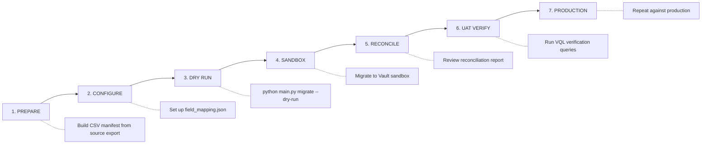

# Veeva Vault Document Migration Toolkit

> A Python-based toolkit for migrating documents from legacy document management systems (SharePoint, Documentum) to **Veeva Vault QualityDocs** — built for GxP-regulated life sciences environments.

## 🎯 What This Does

This toolkit automates the end-to-end migration of controlled documents to Veeva Vault:

```
Source System (SharePoint)  ──→  Field Mapping + Transform  ──→  Vault REST API Upload  ──→  Reconciliation Report
     CSV Manifest                    FieldMapper                     VaultClient                  JSON + CSV Logs
```

## ✨ Features

- **VaultClient** — Python client for the [Veeva Vault REST API](https://developer.veevavault.com/api/) covering authentication, document CRUD, lifecycle actions, VQL queries, and bulk operations (500 docs/batch)
- **MigrationEngine** — Orchestration engine that reads CSV manifests, transforms metadata, uploads documents, verifies integrity (MD5 checksums), and generates reconciliation reports
- **FieldMapper** — Configurable metadata transformation layer mapping source fields/values to Vault fields with default values
- **VQL Reference Library** — 8 sample Vault Query Language queries for common operational scenarios
- **CLI Interface** — Command-line tool for running migrations, executing VQL queries, and verifying results

## 📁 Project Structure

```
vault-migration-toolkit/
├── src/
│   ├── vault_client.py           # Vault REST API client (auth, CRUD, VQL, bulk ops)
│   ├── migration_engine.py       # Migration orchestration + VQL query library
│   └── main.py                   # CLI entry point
├── tests/
│   ├── test_field_mapper.py      # Unit tests for metadata transformation
│   └── test_vault_client.py      # Unit tests for API client
├── config/
│   ├── field_mapping.json        # Source → Vault field/value mappings
│   └── vault_config.template.json # Vault credentials template (copy to vault_config.json)
├── sample_data/
│   └── migration_manifest.csv    # Sample manifest with 15 documents
├── docs/
│   └── migration_plan.md         # Formal data migration plan document
├── migration_logs/               # Generated logs (gitignored)
├── requirements.txt
└── README.md
```

## 🚀 Quick Start

### 1. Clone and Install

```bash
git clone https://github.com/yourusername/vault-migration-toolkit.git
cd vault-migration-toolkit
pip install -r requirements.txt
```

### 2. View Sample VQL Queries (no Vault connection needed)

```bash
python src/main.py samples
```

Output:
```
============================================================
SAMPLE VQL QUERIES FOR VEEVA VAULT
============================================================

--- all_effective_sops ---
SELECT id, name__v, document_number__v, status__v,
       department__c, document_owner__c, effective_date__c
FROM documents
WHERE type__v = 'sop__c'
  AND status__v = 'Effective'
ORDER BY document_number__v ASC

--- documents_by_department ---
...
```

### 3. Run a Dry Migration (validate manifest + field mappings, no upload)

```bash
cd src
python main.py migrate --manifest ../sample_data/migration_manifest.csv --dry-run
```

Output:
```
============================================================
MIGRATION SUMMARY
============================================================
  Total Documents:  15
  Successful:       0
  Failed:           0
  Skipped:          0
  Duration:         0.1 seconds
============================================================
```

### 4. Run Unit Tests

```bash
cd tests
python -m pytest test_field_mapper.py -v
python -m pytest test_vault_client.py -v
```

### 5. Full Migration (requires Vault credentials)

```bash
# Set up credentials
cp config/vault_config.template.json config/vault_config.json
# Edit vault_config.json with your Vault URL, username, password

# Run migration
cd src
python main.py migrate --manifest ../sample_data/migration_manifest.csv
```

### 6. Verify Migration

```bash
python main.py verify --report ../migration_logs/reconciliation_report_*.json
```

## 🔌 Vault REST API Coverage

| API Area | Methods | Endpoints |
|----------|---------|-----------|
| **Authentication** | `authenticate()`, `authenticate_with_discovery()`, `keep_alive()` | `POST /auth`, `POST /auth/discovery`, `POST /keep-alive` |
| **Documents - CRUD** | `create_document()`, `get_document()`, `update_document()`, `delete_document()` | `POST/GET/PUT/DELETE /objects/documents/{id}` |
| **Documents - Content** | `get_document_content()` | `GET /objects/documents/{id}/versions/{v}/file` |
| **Bulk Operations** | `bulk_create_documents()`, `bulk_update_metadata()` | `POST/PUT /objects/documents/batch` |
| **Lifecycles** | `get_document_lifecycle_actions()`, `execute_lifecycle_action()` | `GET/PUT .../lifecycle_actions/{action}` |
| **VQL Queries** | `query()` (with auto-pagination) | `POST /query` |
| **Objects** | `get_object_record()`, `create_object_record()` | `GET/POST /vobjects/{name}/{id}` |
| **System** | `get_api_versions()`, `get_vault_info()` | `GET /api/`, `GET /metadata/vaults` |

## 🔄 Field Mapping Configuration

The `config/field_mapping.json` controls how source metadata transforms to Vault:

```json
{
    "field_mappings": {
        "department": "department__c",
        "classification": "gxp_classification__c",
        "owner_name": "document_owner__c"
    },
    "value_mappings": {
        "department__c": {
            "QA": "Quality",
            "QC": "Laboratory",
            "Mfg": "Manufacturing"
        }
    },
    "default_values": {
        "gxp_classification__c": "GxP",
        "review_cycle_months__c": "24"
    }
}
```

### Supported Transformations

| Source Value | → | Vault Value |
|-------------|---|-------------|
| QA, Quality Assurance | → | Quality |
| QC, Quality Control | → | Laboratory |
| Mfg, Production | → | Manufacturing |
| GMP, GLP | → | GxP |
| Y, TRUE | → | Yes |
| N, FALSE | → | No |
| HQ, Boston | → | NovaPharma HQ - Boston |
| NJ Plant | → | Manufacturing Plant - NJ |

## 📊 Sample VQL Queries

| Query Name | Purpose |
|-----------|---------|
| `all_effective_sops` | Retrieve all SOPs in Effective state with metadata |
| `documents_by_department` | Filter documents by department and status |
| `overdue_periodic_reviews` | Find documents due for periodic review |
| `documents_pending_approval` | List documents awaiting approval workflow completion |
| `recently_superseded` | Last 50 documents moved to Superseded |
| `document_count_by_type_and_status` | Aggregate counts grouped by type and status |
| `search_by_keyword` | Full-text search within document names |
| `migration_verification` | Verify migrated documents by legacy reference number |

## 📋 Migration Workflow



## 🛡️ Regulatory Considerations

Built for GxP-regulated environments:

| Feature | Implementation |
|---------|---------------|
| **Audit Trail** | All migration actions logged with timestamps, document IDs, and status |
| **Data Integrity** | MD5 checksum comparison between source files and uploaded content |
| **Traceability** | Legacy document numbers preserved in `legacy_doc_number__c` custom field |
| **Reconciliation** | Automated JSON report comparing source manifest to Vault state by document type |
| **21 CFR Part 11** | Migration preserves metadata required for electronic records compliance |
| **Rollback** | Document-level, wave-level, and full rollback strategies documented |

## 🛠 Technologies

- **Python 3.8+** with `requests` for HTTP
- **Veeva Vault REST API** (v24.1)
- **VQL** (Vault Query Language)
- **pytest** for unit testing
- **CSV/JSON** for data and configuration
- **MD5** for file integrity verification

## 👤 Author

**Meghana U** — Veeva Vault Consultant | Java Full Stack Developer  
Building expertise in life sciences technology, Vault platform integration, and pharmaceutical compliance.

## 📚 References

- [Veeva Vault API Reference](https://developer.veevavault.com/api/)
- [Veeva Vault Query Language (VQL)](https://developer.veevavault.com/vql/)
- [VAPIL — Vault API Library (Java)](https://github.com/veeva/vault-api-library)
- [Vault Developer Portal](https://developer.veevavault.com)

---

*This is a portfolio project demonstrating Veeva Vault REST API integration and data migration skills. NovaPharma Inc. is a fictional company.*

## License

MIT License
